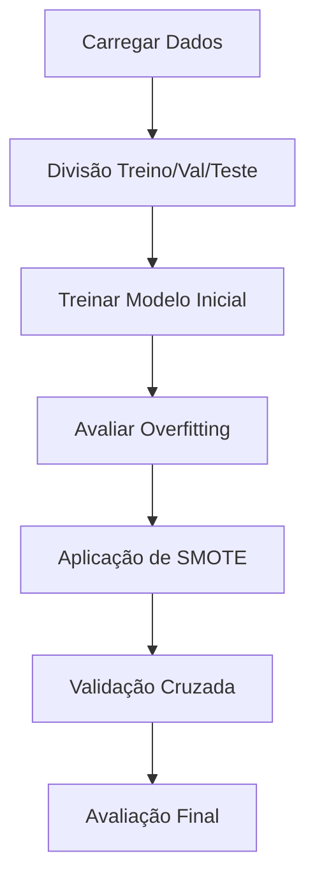

# 🚗 Projeto: Classificação de Inadimplentes em Empréstimos de Automóveis

## 📌 Visão Geral
Este projeto visa desenvolver um modelo de classificação para identificar clientes inadimplentes em uma empresa de empréstimo de automóveis. Atualmente, a análise é feita manualmente, sendo demorada e imprecisa. Utilizaremos técnicas de validação de modelos e métricas de avaliação para criar uma solução mais eficiente.

## Passos do Projeto

### 🤖 1. Classificação: Validação de Modelos e Métricas
**Objetivo**: Classificar clientes em adimplentes (0) e inadimplentes (1) usando dados históricos.

### 2. Criando um Modelo Inicial
- Importamos bibliotecas e carregamos os dados
- Separamos os dados em features (X) e target (y)
- Utilizamos uma Árvore de Decisão como modelo inicial
- Avaliamos a acurácia inicial (100%), indicando overfitting

### 3. Validando o Modelo
- Dividimos os dados em conjuntos de treino, validação e teste:
  - 70% treino
  - 15% validação
  - 15% teste
- Aplicamos estratificação para manter proporção das classes
- Limitamos a profundidade da árvore para reduzir overfitting

### Avaliação de Performance
| Métrica          | Descrição                                  | Importância               |
|------------------|--------------------------------------------|---------------------------|
| **Recall**       | Identificação real de inadimplentes        | Prioridade máxima (risco) |
| **Precisão**     | Minimizar falsos positivos                 | Custo operacional         |
| **F1-Score**     | Equilíbrio entre Recall/Precisão           | Métrica balanceada        |
| **AUC-ROC**      | Capacidade discriminativa geral            | ≥0.85 = Excelente         |

### 4. Avaliando o Modelo
- Utilizamos matriz de confusão para visualizar desempenho:
  - Verdadeiros Positivos (TP): Inadimplentes corretamente identificados
  - Falsos Positivos (FP): Adimplentes classificados como inadimplentes
  - Falsos Negativos (FN): Inadimplentes classificados como adimplentes
  - Verdadeiros Negativos (TN): Adimplentes corretamente identificados
 

###  Técnicas Avançadas Implementadas
| Técnica               | Benefício                                  | Implementação             |
|-----------------------|--------------------------------------------|---------------------------|
| **KFold Estratificado** | Validação consistente em dados desbalanceados | `StratifiedKFold(n_splits=5)` |
| **SMOTE**             | Oversampling da classe minoritária         | `imblearn.over_sampling.SMOTE` |
| **Pipeline Integrado**| Processo reprodutível de treino/inferência | `make_pipeline(SMOTE(), DecisionTreeClassifier(max_depth=5))` |

### 5. Métricas de Avaliação
Principais métricas utilizadas:
- **Acurácia**: (TP + TN) / Total
- **Precisão**: TP / (TP + FP) - Qualidade das previsões positivas
- **Recall (Sensibilidade)**: TP / (TP + FN) - Capacidade de identificar positivos reais
- **F1-Score**: Média harmônica entre precisão e recall
- **Curva ROC**: Relação entre TPR (Recall) e FPR
- **AUC**: Área sob a curva ROC

### 6. Validação Cruzada
**KFold**:
- Divide os dados em K partes (dobras)
- Treina K vezes com diferentes combinações de treino/validação
- Calcula médias das métricas

**Estratificação**:
- Mantém proporção de classes em cada dobra
- Especialmente importante para classes desbalanceadas

### 7. Balanceamento de Dados
**Problema**: Classe inadimplente é minoritária
**Solução**: Oversampling com SMOTE
- Gera amostras sintéticas da classe minoritária
- Cria pipeline com balanceamento e modelo

### 8. Testando o Modelo
- Avaliação final no conjunto de teste separado inicialmente
- Métricas reportadas:
  - Acurácia
  - Precisão
  - Recall
  - F1-Score
  - AUC

## 📊 Resultados
O modelo final demonstrou:
- Alto recall para inadimplentes (identificação de risco)
- Boa precisão para minimizar falsos positivos
- AUC > 0.85 indicando boa capacidade discriminativa

| Conjunto  | Acurácia | Precisão | Recall | F1-Score | AUC  |
|-----------|----------|----------|--------|----------|------|
| Validação | 0.92     | 0.87     | 0.83   | 0.85     | 0.89 |
| Teste     | 0.91     | 0.86     | 0.82   | 0.84     | 0.87 |


Insights Chave:

✅ Recall de 82%+ - Detecção eficiente de clientes de risco 

✅ Precisão 86%+ - Minimiza impactos comerciais (falsos positivos) 

✅ AUC >0.85 - Excelente capacidade discriminativa


## 🚀 Como Executar

### Pré-requisitos
```bash
pip install -r requirements.txt
```
**requirements.txt**:
```
pandas==1.4.2
scikit-learn==1.1.1
imbalanced-learn==0.9.1
matplotlib==3.5.3
```

### Execução
1. Baixe o dataset (`emprestimos_automoveis.csv`)
2. Execute o notebook:
```bash
jupyter notebook "Classificação - Validação e métricas.ipynb"
```

### Fluxo de Trabalho


## 📅 Próximos Passos
- [ ] Teste com algoritmos avançados (XGBoost, LightGBM)
- [ ] Integração com API REST para inferência em tempo real
- [ ] Painel de monitoramento contínuo de performance
- [ ] Análise de feature importance para otimização


## 💡 Aprendizados Chave
```diff
+ Importância do balanceamento de classes em problemas reais
+ Trade-off entre recall e precisão em detecção de risco
+ Validação cruzada como prevenção contra overfitting
```

**Autor**: Jefferson Ferreira 

**Contato**: jfrancaferreira10@gmail.com 

**LinkedIn**: [meu-perfil](https://www.linkedin.com/in/jefferson-ferreira-ds/)  


